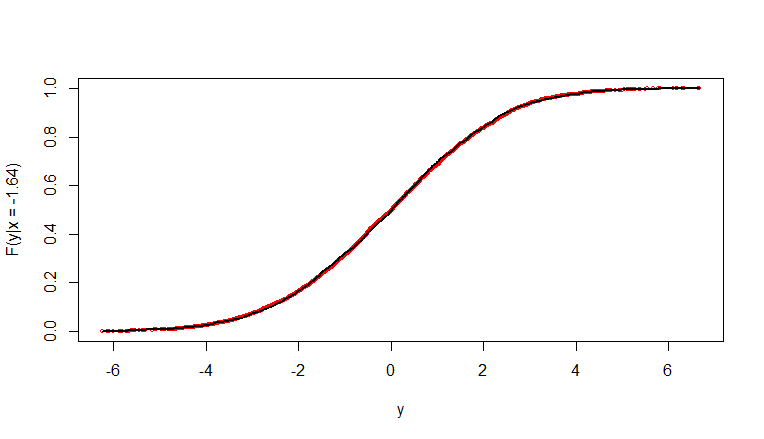

\maketitle

```{=latex}
\thispagestyle{empty} % Hide header and footer on the title page
\vspace*{\fill} % Pushes content to the bottom of the page
\begin{center}
\includegraphics[width=16cm]{imagenes/logo_inst_80.png}\\[1cm] % Adjust image placement
\end{center}
```

\newpage

\tableofcontents

\newpage

```{r, echo=FALSE, message=FALSE, warning=FALSE}
library(tidyverse)
library(readxl)
library(ChainLadder)
library(xtable)
```


# Introducción 

```{r, echo=FALSE, message=FALSE, warning=FALSE}

tri <- as.data.frame(read_excel(path = "siniestros_IBNR.xlsx", skip = 2))
rownames(tri) <- tri[,1]
tri[,1] <- NULL
colnames(tri) <- 1:10
rownames(tri) <- 1999:2008  # se simplifica el nombre de los años a años simples para que facilite el uso de algunas funciones


# triangle class, ready for ChainLadder  /  creacion del objeto tipo triangulo
tri <- as.triangle(as.matrix(tri))

```


En este trabajo se pretende abordar distintos métodos para el cálculo de reservas de IBNR.
El IBNR son los siniestros incurridos y que aún no fueron reclamados. En los seguros de responsabilidad civil, en muchos países, se tiene un período de 10 años para reclamar un seguro luego de que este haya ocurrido.

La idea principal de las reservas de IBNR es poder estar cubierto en el futuro de siniestros que pueden ocurrir en el año corriente (mientras está activa la poliza), pero se reclamaba en los años siguientes.

Para poder  calcular las reservas de IBNR hay varios métodos, y todos utilizan la información de años anteriores para poder predecir cómo se comportan los reclamos en los años siguientes.

Se suele trabajar con 3 matrices triangulares, donde cada fila es un año, y en las columnas tenemos los años transcurridos. En la última fila se encuentra el último año, por lo que tiene datos para una sola columna, el año corriente, y así cada fila va teniendo dato para una columna más, llegando a la primer fila, que es el último año que se tiene en cuenta, y para el cual se tiene información para todos los años transcurridos, así queda explicada la forma de la matriz triangular.

La primer matriz triangular tiene la información de los pagos acumulados de los siniestros ocurridos en cada año, y cuando fueron pagados efectivamente. Para la primer fila, en la primer columna se tienen los pagos de los siniestros ocurridos y pagados hace 10 años, luego en la siguiente columna se tiene los siniestros ocurridos en ese año pero pagados en el siguiente, más los de la columna anterior (por ser pagos acumuados) y así sucesivamente.

La segunda matriz es la matriz de siniestros pendientes de pagos, que tiene para cada año celda, los siniestros ocurridos en la fila a la que pertenece, y reportados pasado los años según la columna en la que está, es decir, salvo los de la primera columna, todos reportados luego de pasado cierta cantidad de años, pero que aún no han sido pagados, ya sea por litigio, o por que se está estimando el valor final a pagar.

En última instancia tenemos la matriz triangulas de siniestros incurridos, que en cada celda se tiene la suma de las dos matrices anteriores que es el total de los siniestros totales acumulados y reservados ocurridos en cada año y que han ido ocurriendo a lo largo de los años siguientes. Cada diagonal (en el sentido inverso, $X_{1,n}, X_{2,n-1}, \ldots , X_{n,1}$) corresponde a los pagos acumulados y reservados de un ejercicio contable.

La reserva de IBNR es la reserva que debe tener la compañía pasado $n$ años (en general 10 años) para poder cubrir los siniestros ocurridos en el año actual, y que serán reportados durante lossiguientes años.

Se trabajará con la matriz de siniestros trabajada en el curso de 'Solvencias de Compañías Aseguradoras' brindado por el profesor Enrique Arónica en noviembre de 2023 en la Facultad de Ciencias Económicas, se cuenta con la matriz de pagos acumulados, la matriz de siniestros pendientes de pagos y la de siniestros incurridos, esta última se presenta a continuación, que se encuentra guardada en un objeto de tipo **triangle**.

```{r, echo=FALSE, warning=FALSE, message=FALSE, fig.cap='long caption', fig.scap='short', tidy=FALSE}
tri

#print(xtable(tri), type="latex") # , results = 'asis'
#knitr::kable(tri, format = "latex", booktabs = TRUE)
```

Al tener la matriz guardada en un objeto especial, la función plot nos permiete ver como crecen los siniestros incurridos en cada período con el correr de los años, obteniendo así una línea para cada año de ocurrencia y observando el crecimiento de los siniestros incurridos durante los períodos de desarrollo

```{r, echo=FALSE,message=FALSE,warning=FALSE,caption = "Cada línea representa los siniestros incurridos en un período, y se ve como va aumentando los pagos acumulados y reservados con el correr de los períodos"}
plot(tri/1000,  main = "Desarrollo de los reclamos por período")
```

# Metodología


## Chain Ladder 'clásico'

Uno de los métodos más utilizados es el de 'Chain Ladder' (Escalera de Cadera), que a partir de la última matriz presentada en la sección anterior calcula los factores de desarrollo, que miden el crecimiento de los gastos por siniestro pasado los años. El factor de desarrollo representa la proporción que aumentan el monto de los siniestros incurridos entre dos períodos consecutivos (el factor de desarrollo $q_j$ representa el aumento de los siniestros incurridos entre el período $j$ y el $j+1$). Para el cálculo de este, se suma todos los siniestros incurridos en el período $j+1$, es decir $\sum_{i=1}^{n-j} X_{i,j+1}$ y se los divide entre la misma cantidad de filas, del período anterior ($j$), es decir $\sum_{i=1}^{n-j} X_{i,j}$

$$
\hat{q}_{j} = \frac{\sum_{i=1}^{n-j} X_{i,j+1}}{\sum_{i=1}^{n-j} X_{i,j}}
$$

El total a pagar y reservar por los siniestros ocurridos en el año $i$ es el producto de $X_i = Q_j\cdot X_{i,j}$, donde $Q_j$ es el factor de desarrollo acumulado, que representa el aumento de los siniestros pagados acumulados y reservados al período $j$ ($X_{i,j}$), hasta el total que se va a pagar por los siniestros incurridos en el año $i$ ($X_i$). Se puede demostrar que el factor de desarrollo acumulado se calcula de forma iterativa a través de la fórmula $Q_{j-1}=q_{j-1}\cdot Q_{j}$, y en particular, $Q_n = 1$ que representa el aumento de los siniestros pagados acumulados y reservados ocurridos en el primer año que se está tomando, y acumulado durante los $n$ años siguientes, que luego, por cuestiones jurídicas no habrá nuevos reclamos.

Luego, podemos decir que $X_i$ es la pérdida esperada por los siniestros incurridos en el año i, y nuestra reserva de $IBNR_i$, que es la reserva para los siniestros ocurridos en el año $i$ y que fueron denunciados en los años posteriores será la diferencia entre la pérdida esperada, y el último período para el que tenemos los pagos acumulados y reservados en la matriz de siniestros incurridos ($X_{i,n-i+1}$)

```{r, echo=FALSE,warning=FALSE,message=FALSE}

linkratios <- c(attr(ata(tri), "vwtd"), tail = 1)  #se elige cola a discrecion (factor de arranque)
linkratios <- round(linkratios, 3)

QAcum <- rev(cumprod(rev(linkratios)))
names(QAcum) <- colnames(tri) # so the display matches the triangle
QAcum <- round(QAcum, 3)

```


```{r, echo=FALSE,warning=FALSE,message=FALSE}
Incurridos_Acumulados <- getLatestCumulative(tri) # para obtener la diagonal inversa principal de nuestra matriz triangular (ultimos reclamos acumulados de cada anio)
# Reverse the LDFs so the first, least mature factor [1]
#   is applied to the last origin year (1990)
Perdida_Esperada <- Incurridos_Acumulados * rev(QAcum) #ultima perdida esperada
# Start with the body of the exhibit

Reserva_IBNR = Perdida_Esperada - Incurridos_Acumulados

Exhibit <- data.frame(Incurridos_Acumulados, QAcum = round(rev(QAcum), 3), Perdida_Esperada, Reserva_IBNR)
# Tack on a Total row


Exhibit <- rbind(Exhibit,
                 data.frame(Incurridos_Acumulados=sum(Incurridos_Acumulados), QAcum=NA, Perdida_Esperada=sum(Perdida_Esperada),
Reserva_IBNR = sum(Reserva_IBNR),                            
                            row.names = "Total"))


Exhibit

```


También se puede asignar un valor mayor a 1 para el factor de desarrollo del último año $Q_n>1$, por distintas cuestiones que no son de particular interés en este trabajo, por ejemplo $Q_n=1,05$, y luego los siguientes factores de desarrollo quedaran determinados a partir de este primero.


## Chain Ladder con regresión

Este modelo permite calcular el factor de desarrollo para $Q_n$ asumiendo una estructura de regresión para los factores de desarrollos (simples) en función de los períodos de desarrollo. Si bien estos no varían mucho a lo largo del tiempo, si se puede observar una estructura de regresión lineal si hacemos el logaritmo del aumento proporcional ($q-1$) de los siniestros incurridos en función de los períodos de desarrollo $L(q-1) \sim \text{períodos de desarrollo}$.

$$
L(q_j -1) = \alpha + \beta\times j
$$

```{r, echo=FALSE,warning=FALSE,message=FALSE}
n <- 10
q <- sapply(1:(n-1),
            function(i){
              sum(tri[c(1:(n-i)),i+1])/sum(tri[c(1:(n-i)),i])
            }
)
q


# modelo lineal de los factores de desarrollo explicado por los anios (log(f-1))
dev.period <- 1:(n-1)
tail.model <- lm(log(q-1) ~ dev.period)

plot(log(q-1) ~ dev.period, 
     main="Extrapolación Log-lineal de los factores año a año") +
abline(tail.model)

```


Para esto es necesario haber calculado los factores de desarrollo simple y hacer el modelo correspondiente, previamente chequendo si para el gráfico de dispersión de los datos corresopnde el modelo de regresión lineal.
Luego, se sugiere extrapolar los datos para 100 períodos de desarrollo, y se puede observar que se empieza a estabilizar $L(q_j -1)$ cuando $j$ aumenta, y si tomamos $Q_n$ el factor de desarrollo acumulado para el período que estamos trabajando, podemos calcular $\hat{Q_n} = \prod_{j\geq n} \hat{q_{j}} = 1.021795$.

```{r, echo=FALSE,warning=FALSE,message=FALSE}
# estudio de la ibnr para periodos mas largos
co <- coef(tail.model)
## extrapolate another 100 dev. period de los factores de desarrollo
tail <- exp(co[1] + c(n:(n + 100)) * co[2]) + 1
f.tail <- prod(tail)

plot(100*(rev(1/cumprod(rev(c(q, tail[tail>1.0001]))))), t="b",
     main="Expected claims development pattern",
     xlab="Dev. period", ylab="Development % of ultimate loss")


plot(100*(rev(1/cumprod(rev(c(q, tail))))), t="b",
     main="Expected claims development pattern",
     xlab="Dev. period", ylab="Development % of ultimate loss")

```


```{r, echo=FALSE,warning=FALSE,message=FALSE}

Qhat = f.tail

Qhat

```

Nuestros factores de desarrollo serán los obtenidos normalmente hasta el momento $n-1=9$ y se para $q_n=q_{10}$ se le asigna el valor de $\hat{Q_n}$ calculado que ya se mostró que para el último período de desarrollo era válida la equivalencia.

```{r, echo=FALSE,warning=FALSE,message=FALSE}
qs <- c(q,Qhat)

Qs <- rev(cumprod(rev(qs)))
names(Qs) <- colnames(tri) # so the display matches the triangle
Qs <- round(Qs, 3)

```

```{r, echo=FALSE}
Incurridos_Acumulados2 <- getLatestCumulative(tri) # para obtener la diagonal inversa principal de nuestra matriz triangular (ultimos reclamos acumulados de cada anio)
# Reverse the LDFs so the first, least mature factor [1]
#   is applied to the last origin year (1990)
Perdida_Esperada2 <- Incurridos_Acumulados2 * rev(Qs) #ultima perdida esperada
# Start with the body of the exhibit

Reserva_IBNR2 = Perdida_Esperada2 - Incurridos_Acumulados2

Exhibit2 <- data.frame(Incurridos_Acumulados2, Qs = round(rev(Qs), 3), Perdida_Esperada2, Reserva_IBNR2)
# Tack on a Total row


Exhibit2 <- rbind(Exhibit2,
                 data.frame(Incurridos_Acumulados2=sum(Incurridos_Acumulados2), Qs=NA, Perdida_Esperada2=sum(Perdida_Esperada2),
Reserva_IBNR2 = sum(Reserva_IBNR2),                            
                            row.names = "Total"))


Exhibit2


```
## Mack Chain-Ladder

Thomas Mack publica en 1993 un método para obtener estimaciones de los errores estándar de las estimaciones de pérdida esperada, y por consecuencia del IBNR, se basa en la matriz triangular de pérdida agregada pero nosotros lo usaremos sobre la matriz triangular de siniestros incurridos, y se puede predecir el triángulo inferior faltante de la matriz, es decir, los siniestros incurridos a futuro de cada año para cada período de desarrollo.

Para predecir los siniestros incurridos a futuro $X_{i,j}$ con $j>n-i+1$ se asume:

\begin{itemize}

\item $\mathbb{E}(q_{i,j}|X_{i,1},\ldots,X_{i,j}) = q_j$ con $q_{i,j} = \frac{X_{i,j+1}}{X_{i,j}}$

\item $\mathbb{V}(q_{i.j}|X_{i,1},\ldots,X_{i,j}) = \frac{\sigma^2_j}{w_{i,j}X_{i,j}^\alpha} $

\item $\{ X_{i,1},\ldots,X_{i,n} \}, \{X_{k,1},\ldots,X_{k,n}\}$ son independientes del período de origen ($i \neq k$)

\end{itemize}


Con $w_{i,j} \in [0;1]$ y $\alpha \in \{0,1,2\}$, se obtienen estimaciones insesgadas de las pérdidas esperadas y de las reservas de IBNR junto a los errores estándar y el coeficiente de variación.

Luego, a partir de la fórmula del error cuadrático medio, $ECM(\hat{X}_{i,n})=\mathbb{E}((\hat{X}_{i,n}-X_{i,n})^2|X_{i,1}\ldots,X_{i,n-i+1})=\mathbb{V}(\hat{X}_{i,n}) + (\mathbb{E}(X_{i,n}|X_{i,1}\ldots,X_{i,n-i+1})-\hat{X}_{i,n})^2$ se podrá calcular el error cuadrático medio como la suma de los errores estocásticos y el error de estimación y se necesitará una fórmila para la varianza.

Se puede notar que el factor de desarrollo $q_j$ es el promedio ponderado de los factores $q_{i,j}=X_{i,j+1}/X_{i,j}$, por lo que la varianza de $X_{i,j+1}/X_{i,j}$ (dado los siniestros hasta el período de desarrollo j) es inversamente proporcional a $X_{i,j}$, donde se asume que todos los siniestros incurridos pesan igual y $\alpha=0$ en las condiciones planteadas anteriormente.

$$
\mathbb{V}(X_{i,j+1}|X_{i,1},\ldots,X_{i,j}) = X_{i,j}\cdot \sigma_j^2
$$
Donde $\sigma_j^2$ es un parámetro desconocido que debe ser estimado, y es la varianza implicita bajo el método de 'Chain Ladder'. Por lo que la varianza estimada será la suma de los errores al cuadrado ponderados de la estimación de los factores de desarrollo año a año.

$$
\hat{\sigma_j}^2 = \frac{1}{n-j-1}\cdot \sum_{i=1}^{n-j} X_{i,j}\left( \frac{X_{i,j+1}}{X_{i,j}} - \hat{q_j} \right)^2=\frac{1}{n-j-1}\cdot \sum_{i=1}^{n-j} X_{i,j}\left( q_{i,j} - \hat{q_j} \right)^2
$$

Siendo $\hat{\sigma_j}^2$ un estimador insesgado para $1 \leq j \leq n-2$, obteniendo una estimación del desvío al hacer la raíz. Para estimar $\sigma_{n-1}$ , si se tiene que $\hat{q}_{n-1}=1$ se puede utilizar $\sigma_{n-1}=0$ ya que se asume que el desarrollo de los siniestros termina en el tiempo $n-1$, de lo contrario se puede extrapolar utilizando la reducción exponencial de los desvíos de forma tal que $\hat{\sigma}_{n-1}$ cumpla con la razón.

$$
\frac{\hat{\sigma}_{n-3}}{\hat{\sigma}_{n-2}} = \frac{\hat{\sigma}_{n-2}}{\hat{\sigma}_{n-1}} \\
\hat{\sigma}_{n-1} = \frac{\hat{\sigma}_{n-2}^2}{\hat{\sigma}_{n-3}}
$$

Siendo $R_i$ las reservas de IBNR del año $i$, estas son calculadas como $R_i = X_{i,n} - X_{i,n-i+1}$ y estimadas de la forma $\hat{R}_i = \hat{X}_{i,n} - X_{i,n-i+1}$ donde el total de los costos incurridos del año $i$ son estimados a través de los factores de desarrollo, ya sea calculando el total para todos los años de desarrollo con los factores año a año, o a través del factor de desarrollo acumulado $\hat{X}_{i,n} = Q_{n-i+1}\cdot X_{i,n-i+1}$. Luego, como la única parte aleatoria de $\hat{R}_i$ es $\hat{X}_{i,n}$ el $ECM(\hat{R}_i) = ECM(\hat{X}_{i,n})$


$$
\widehat{ECM}(\hat{R}_i) = \hat{X}_{i,n}^2 \sum_{j=n-i+1}^{n-1} \frac{\hat{\sigma_j}^2}{\hat{q}_j}\left( \frac{1}{\hat{X}_{i,j}} - \frac{1}{\sum_{l=1}^{I-j}X_{l,j}} \right)
$$

La función 'MackChainLadder' del paquete 'ChainLadder' nos da una tabla con las reservas de IBNR para cada año, su desvío y su coeficiente de variación, y las mismas medidas para el total, teniendo especial atentción de que el desvío del total no es igual a la suma del desvío, nos muestra la última pérdida obtenida, la última pérdida esperada, la relación entre estas, la reserva de IBNR, el desvío y el coeficiente de variación.

```{r, echo=FALSE,message=FALSE,warning=FALSE}

mackTRI <- MackChainLadder(tri)

mackTRI

```

También se puede acceder a los factores mediante acciedendo a 'mackTRI\$f', o a la matriz completa con la estimación de los siniestros incurridos en los años siguientes mediante 'mackTRI\$FullTriangle'.

```{r, echo=FALSE, message=FALSE,warning=FALSE}
mackTRI$f
```

```{r, echo=FALSE, message=FALSE,warning=FALSE}
mackTRI$FullTriangle
```

Y al resumen final separado por año o para el total se accede mediante summary de la manera:

```{r, echo=FALSE, message=FALSE,warning=FALSE}

resumenMackTRI <- summary(mackTRI)

resumenMackTRI$ByOrigin

```

```{r, echo=FALSE, message=FALSE,warning=FALSE}

resumenMackTRI$Totals

```
Y se accede a distintos gráficos con la función plot

```{r, echo=FALSE, out.width="100%", fig.cap = ""}
plot(mackTRI)
```

También se puede graficar la predicción del desarrollo de los siniestros incurridos a futuro junto a una medida de la dispersión, separado por cada año de ocurrencia

```{r, echo=FALSE}
plot(mackTRI, lattice=TRUE)
```


## Munich Chain Ladder

El método de Munich utiliza la correlación positiva entre el triángulo de siniestros incurridos y el triángulo de siniestros pagados acumulados para proyectar los futuros pagos. Para esto es necesario agregarla información los datos de siniestros pagos acumulados.


```{r, echo=FALSE, message=FALSE, warning=FALSE}

acum <- as.data.frame(read_excel(path = "pagos_acumulados_IBNR.xlsx", skip = 2))
rownames(acum) <- acum[,1]
acum[,1] <- NULL
colnames(acum) <- 1:10
rownames(acum) <- 1999:2008  # se simplifica el nombre de los años a años simples para que facilite el uso de algunas funciones


# triangle class, ready for ChainLadder  /  creacion del objeto tipo triangulo
acum <- as.triangle(as.matrix(acum))

```

Llamando *I* a la matriz de siniestros incurridos y *P* a la matriz de siniestros pagados, se halla la matriz $P/I$ calculada como la división de celda a celda de la matriz *P* entre la matriz *I*, y representa la fracción de los siniestros incurridos que ya están pago de cada año durante los períodos de desarrollo. Donde se suele observar que a medida que hay más períodos de desarrollo la mayoría de los siniestros han sido pagados.

```{r, echo=FALSE, message=FALSE, warning=FALSE}

frac <- acum/tri

fracframe <- as.data.frame(frac)

fracframe <- fracframe %>% mutate(
  devf = as.factor(dev)
)

# movi el grafico para el siguiente chunk para que salieran juntos
```

Formalmente, se tiene que $(P/I)_{i,j} = P_{i,j}/I_{i,j}$, luego, mediante los métodos vistos antes de Chain Ladder se puede estimar los valores faltantes de la matriz con los factores de desarrollo año a año a partir de la diagonal inversa, obteniendo el resultado de los ratios si se hace Chain-Ladder por separado (SCL).

```{r, echo=FALSE, message=FALSE, warning=FALSE, fig.show="hold", out.width="50%"}

trifull <- mackTRI$FullTriangle

mackACUM <- MackChainLadder(acum)

acumfull <- mackACUM$FullTriangle


fracfull <- acumfull/trifull

fracfullframe <- as.data.frame(fracfull)

fracfullframe <- fracfullframe %>% mutate(
  originn = as.numeric(origin)
)

fracfullframe <- fracfullframe %>% mutate(
  Tipo = ifelse(originn+dev>2009, "pred","obs")
)


ggplot(fracframe, aes(x=dev, y=100*value)) + geom_point(alpha=1, size = 2) +
  geom_line(stat = "summary", fun.y = "mean", color = "red", size = 1) +
  theme_bw() +
  ylim(c(10,120))

ggplot(fracfullframe, aes(x=dev, y=100*value, alpha = Tipo)) + geom_point(size = 2) +
  geom_line(stat = "summary", fun.y = "mean", size = 1) + scale_alpha_manual(values = c(1,0.3)) +
  theme_bw() +
  ylim(c(10,120))
```
Se puede notar en la segunda figura que para los valores proyectados a partir de cierto período de desarrollo se tiene que los siniestros pagados significan una proporción mayor a 1 que los siniestros incurridos, este error se da debido a que se aplicó el método de Chain-Ladder por separado a ambos triángulos (SCL) y no se tuvo en cuenta la estructura de correlación entre ambos triángulos.

Para concluir el principal resultado de este método se debe hacer cuentas con los factores de desarrollo y las proyecciones tanto en la matriz de pagos acomulados como la de siniestros incurridos. Para esto define el promedio de los ratios en el tiempo de desarrollo t:

$$
(P/I)_t := \frac{\sum_{j=1}^n P_{j,t}}{\sum_{j=1}^n I_{j,t}} = \frac{1}{\sum_{j=1}^n I_{j,t}}\cdot \sum_{j=1}^n I_{j,t}\cdot (P/I)_{j,t}
$$

Y luego, definiendo $c_i:n-i+1$ como el último período de desarrollo del que se tiene información para los siniestros, tanto los pagados acumulados como los incurridos y se puede observas que los pares $(i,c_i)$ son los índices de la diagonal invertida de las matrices. Luego, observando que para el año $i$, los valores de $P_{i,t}$ y $I_{i,t}$ son proyecciones para $t>c_i$ se tiene que el ratio $(P/I)_{i,t}$ se calcula

$$
(P/I)_{i,t} = \frac{P_{i,t}}{I_{i,t}} = \frac{P_{i,c_i}\cdot q_{c_i}^P \cdot \ldots \cdot q_{t-1}^P}{I_{i,c_i}\cdot q_{c_i}^I \cdot \ldots \cdot q_{t-1}^I}
$$

A partir de las fórmulas de los factores de desarrollo, se nota que para $t>c_i$:

$$
(P/I)_{i,t} = \frac{P_{i.c_i}\cdot \frac{\sum_{j=1}^n P_{j,t}}{\sum_{j=1}^n P_{j,c_i}}}{I_{i.c_i}\cdot \frac{\sum_{j=1}^n I_{j,t}}{\sum_{j=1}^n I_{j,c_i}}}
$$
Y reordenando se tiene la siguiente relación para los ratios proyectados mediante la aplicación de Chain-Ladder por separado:

$$
\frac{(P/I)_{i,t}}{(P/I)_t} = \frac{(P/I)_{i,c_i}}{(P/I)_{c_i}}
$$

Que indica que para cada año de accidente, el ratio de $(P/I)_{i,t}$ con el $(P/I)_t$ promedio en el período de desarrollo t, debe cumplir la misma relación que en el período $c_i$, y esto se ve claramente en la figura 2 cuando se hace Chain-Ladder por separado siendo la principal debilidad del método.

Veamos que la correlación entre los factores de desarrollo para cada año de ocurrencia del primer período de desarrollo de la matriz de pagos acumulados, es decir, el vector de $q_{i,1}^P$ $\forall i = \{1,2,\ldots,10\}$ respecto a los ratios $(P/I)_{1,j}$ es de $-0.7278$.

```{r, echo=FALSE, message=FALSE, warning=FALSE}
qi1p <- c()

fraci1 <- c()

for(i in 1:9){
  qi1p[i] = acum[i,2]/acum[i,1];
  fraci1[i] = acum[i,1]/tri[i,1]
}

correlation=cor(fraci1,qi1p)
```


```{r, echo=FALSE, message=FALSE, warning=FALSE}
ggplot(data.frame(fraci1, qi1p), aes(x = fraci1, y = qi1p)) +
  geom_point() +
  geom_vline(xintercept = mean(fraci1), linetype = "dashed", color = "red") +
  geom_hline(yintercept = mean(qi1p), linetype = "dashed", color = "blue") +
  labs(title = paste("Gráfico de Dispersión\nCorrelación: ", round(correlation, 2)),
       x = "fraci1", y = "qi1I")


```

Y por otro lado, haciendo lo mismo para los factores de desarrollo individuales del primer período de la matriz de siniestros incurridos y los ratios del primer período de desarrollo se tiene una correlación positiva más débil de $0.3572$


```{r, echo=FALSE, message=FALSE, warning=FALSE}
qi1I <- c()

fraci1 <- c()

for(i in 1:9){
  qi1I[i] = tri[i,2]/tri[i,1];
  fraci1[i] = acum[i,1]/tri[i,1]
}

correlation=cor(fraci1,qi1I)
```


```{r, echo=FALSE, message=FALSE, warning=FALSE}
ggplot(data.frame(fraci1, qi1I), aes(x = fraci1, y = qi1I)) +
  geom_point() +
  geom_vline(xintercept = mean(fraci1), linetype = "dashed", color = "red") +
  geom_hline(yintercept = mean(qi1I), linetype = "dashed", color = "blue") +
  labs(title = paste("Gráfico de Dispersión\nCorrelación: ", round(correlation, 2)),
       x = "fraci1", y = "qi1I")

```

Parece ser que uno de los problemas principales es asumir un factor igual para todos los años de ocurrencia, dado un período de desarrollo y se nota que estos factores depende de los ratios $(P/I)$.

También es claro que con el correr de los períodos de desarrollo se tendrán menos puntos en nuestro gráfico, y los resultados serán menos consistentes, y además, los factores de desarrollo individuales para cada año deben ser ajustados tanto para la matriz de pagos acumulados como la de siniestros incurridos, pero la pregunta es en que medida cada uno, esto expresa la idea básica para resolver el problema del método SCL.

Siendo que para cada período de desarrollo se tiene un gráfico de puntos como el anterior, pero cada vez con menos puntos, la idea es hacer una regresión lineal en cada caso, y estimar el factor de desarrollo para cada $(P/I)$, y de esta forma se puede predecir la parte restante de la matriz. Por ejemplo, para el factor de desarrollo individual $q_{1,10}$ que no se tiene valores de la columna siguiente del triángulo para calcularlo, se puede predecir con la regresión a partir del valor $(P/I)_{1,10}$

Algunos problemas que pueden surgir de este método es que no siempre una regresión lineal explica es buena para explicar los factores de desarrollo individuales. Para esto, en caso de que se observe una hipérbole en los datos se sugiere implementar el ratio $(I/P)=\frac{1}{(P/I)}$, para poder ajustar de mejor manera los factor de desarrollo de los pagos acumulados en función de $(P/I)$ por la estructura hiperbólica que parece tener que se observa en la figura

```{r, echo=FALSE,message=FALSE,warning=FALSE}

qi1p <- c()

fracinvi1 <- c()

for(i in 1:9){
  qi1p[i] = acum[i,2]/acum[i,1];
  fracinvi1[i] = tri[i,1]/acum[i,1]
}

cor(fracinvi1,qi1p)

plot(fracinvi1,qi1p)

```

El segundo problema que se puede observar, es que, con el pasar de los períodos de desarrollo, que se tienen menos datos, las estimaciones son muy volátiles, incluso algunas veces se pueden obtener regresiones con el signo incorrecto en el coeficiente. Y por último, a veces no hay una estructura clara que refleje correlación. O la misma es muy débil.

El método de Munich considera todos los coeficientes de desarrollo juntos, para todos los años y todos los períodos, y también los ratios $(P/I)$ y $(I/P)$ teniendo todos los valores estandarizados, es decir, restando la esperanza y diviendo entre el desvío, obteniendo así datos con media 0 y desvío 1.

Luego, como los datos están estandarizados, se puede graficar todos los datos juntos para los factores de desarrollo individuales estandarizados de los pagos acumulados vs los ratios $(I/P)$ y los factores de desarrollo individuales estandarizados de los siniestros incurridos vs los ratios $(P/I)$, luego se puede hacer la regresión con la nube de puntos que tiene más datos, y calcular la estimación de los factores de desarrollo a partir del modelo lineal. Lo mismo para la estimación de los factores de desarrollo individuales para los estimar la parte de la matriz que falta. Todo este método se puede aplicar a partir de la función 'MunichChainLadder' del paquete ChainLadder, a la que se le debe pasar como argumento los dos triangulos, el de pagos acumulados y el de siniestros incurridos.


```{r, echo=FALSE,message=FALSE,warning=FALSE}

BayernMunich <- MunichChainLadder(acum,tri)


BayernMunich


```
```{r, echo=FALSE,message=FALSE,warning=FALSE}

plot(BayernMunich)

```

```{r, echo=FALSE,message=FALSE,warning=FALSE}

summary(BayernMunich)$ByOrigin

summary(BayernMunich)$Totals


```


%

%[Nadaraya-Watson](#bib)


\newpage


# Bibliografía {-#bib}

::: {#refs}
:::

# Material adicional {-}

La entrega del informe viene acompañado de 2 scripts, que contienen la implementación de cada método presentado junto con las aplicaciones realizadas:

- \texttt{quantile\_regression\_by\_huang-nguyen.R}

- \texttt{quantile\_regression\_by\_yu-jones.R}

