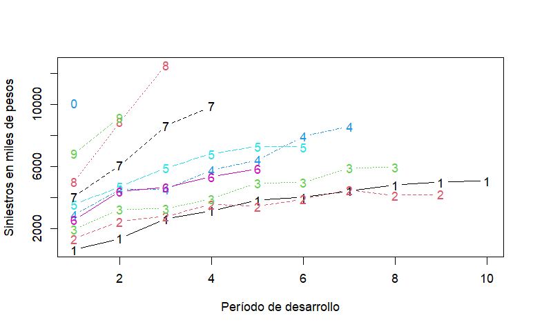
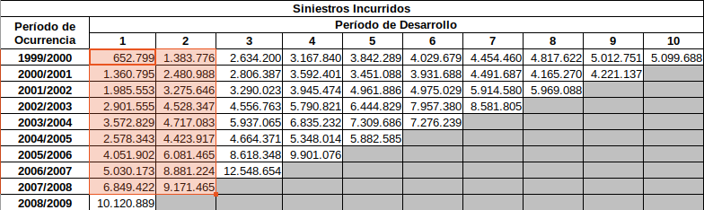

\maketitle

```{=latex}
\thispagestyle{empty} % Hide header and footer on the title page
\vspace*{\fill} % Pushes content to the bottom of the page
\begin{center}
\includegraphics[width=16cm]{imagenes/logo_inst_80.png}\\[1cm] % Adjust image placement
\end{center}
```

\newpage

\tableofcontents

\newpage

```{r, echo=FALSE, message=FALSE, warning=FALSE}
library(tidyverse)
library(readxl)
library(ChainLadder)
library(xtable)
library(latex2exp)
```


# Introducción 

```{r, echo=FALSE, message=FALSE, warning=FALSE}

tri <- as.data.frame(read_excel(path = "siniestros_IBNR.xlsx", skip = 2))
rownames(tri) <- tri[,1]
tri[,1] <- NULL
colnames(tri) <- 1:10
rownames(tri) <- 1999:2008  # se simplifica el nombre de los años a años simples para que facilite el uso de algunas funciones

tri2 <- tri

# triangle class, ready for ChainLadder  /  creacion del objeto tipo triangulo
tri <- as.triangle(as.matrix(tri))

```


En este trabajo se pretende abordar distintos métodos para el cálculo de reservas técnicas asociadas al IBNR. El IBNR por sus siglas en inglés, son los siniestros incurridos y que aún no fueron reclamados. En muchos países, los seguros de responsabilidad civil, cuentan con un período de 10 años para el reclamo de un seguro luego de que el siniestro haya ocurrido.

La idea principal de las reservas de IBNR es poder estar cubierto en el futuro de siniestros que ocurrieron en el año corriente (mientras está activa la poliza), pero el reclamo es efectuado en los años siguientes.

Para poder calcular las reservas de IBNR hay varios métodos, basados en la utilización de información previa (recolectada en años anteriores), para poder predecir cómo se comportan los reclamos en los años siguientes.

Se suele trabajar con 3 matrices triangulares, donde las filas son años, y las columnas son los años transcurridos. Observesé el cuadro \ref{tabla1}, en la última fila se encuentra el último año, el cuál se tiene datos para una sola columna, el año corriente. La fila anterior tendrá una columna más, es decir tendrá información de dos períodos transcurridos, de esta manera se llega a la primer fila, la cuál es el último año que se tiene en cuenta, y para el cual se tiene información de todos los años transcurridos, de esta manera queda explicada la forma de la matriz triangular.

```{r, echo=FALSE, fig.pos="h", message=FALSE, warning=FALSE, results='asis'}

print(xtable(tri2, type="latex", align="ccccccccccc", digits = 0, caption="Siniestros incurridos acumulados por año y por período transcurrido en pesos.", label = "tabla1"), caption.placement = "top", comment = FALSE, size="\\fontsize{8.5pt}{10pt}\\selectfont")

```

La primer matriz triangular tiene la información de los pagos acumulados de los siniestros ocurridos en cada año, y cuando fueron pagados efectivamente. Para la primer fila, en la primer columna se tienen los pagos de los siniestros ocurridos y pagados hace 10 años, luego en la siguiente columna se tiene los siniestros ocurridos en ese año pero reclamados y pagados en el siguiente, más los de la columna anterior (por ser pagos acumulados) y así sucesivamente.

La segunda matriz es la matriz de siniestros pendientes de pagos, que tiene para cada celda (año), los siniestros ocurridos en la fila a la que pertenece, y reportados pasado los años según la columna en la que está, es decir, salvo los de la primera columna, todos son reportados luego de pasado cierta cantidad de años, pero que aún no han sido pagados, ya sea por litigio, o por que se está estimando el valor final a pagar.

En última instancia tenemos la matriz triangular de siniestros incurridos (cuadro \ref{tabla1}). En cada celda se tiene la suma de las dos matrices anteriores que es el total de los siniestros acumulados y reservados ocurridos en cada año y que han ido ocurriendo a lo largo de los años siguientes. Cada diagonal (en el sentido inverso, $X_{1,n}, X_{2,n-1}, \ldots , X_{n,1}$) corresponde a los pagos acumulados y reservados de un ejercicio contable.

La reserva de IBNR es la reserva que debe tener la compañía pasado $n$ años (en general 10 años) para poder cubrir los siniestros ocurridos en el año actual, y que serán reportados durante los siguientes años.

Se trabajará con la matriz de siniestros trabajada en el curso de "Solvencias de Compañías Aseguradoras" brindado por el profesor \textit{Enrique Arónica} en Noviembre de 2023 en la Facultad de Ciencias Económicas (UDELAR). Se cuenta con la matriz de pagos acumulados, la matriz de siniestros pendientes de pagos y la de siniestros incurridos.

La figura \ref{triangle} fue realizada con la función \texttt{plot} de \texttt{R} base, la cual fue aplicada a un objeto (matriz de siniestros incurridos) de clase \texttt{triangle}. Esta figura nos permite ver como crecen los siniestros incurridos en cada período con el correr de los años, obteniendo así una línea para cada año de ocurrencia y observando el crecimiento de los siniestros incurridos durante los períodos de desarrollo. Cada línea representa los siniestros incurridos en un período, y se ve como va aumentando los pagos acumulados y reservados con el correr de los períodos.

```{r, echo=FALSE, message=FALSE, warning=FALSE, fig.cap="\\label{triangle} Desarrollo de los reclamos por año y período."}

plot(tri/1000, ylab="Siniestros en miles de pesos", xlab="Periodo de desarrollo")
#

```


# Chain-Ladder

El objetivo de este trabajo es presentar distintos métodos para estimar los siniestros incurridos que se tendrán pasado los años de desarrollo. Y de esta manera obtener la reserva necesaria para hacer frente a lo que será reclamado.

Una de las principales herramientas del Chain-Ladder son los factores de desarrollo que se definiran más adelante. Se utilizan tanto en las matrices de pagos acumulados como en la de siniestros incurridos, y es el factor por el que los valores van creciendo de un período a otro. A veces se utiliza un solo factor de desarrollo para todo el período de desarrollo (ejemplo, para el crecimiento de los siniestros/pagos del período 6 al 7, sin importar el año de ocurrencia, lo que sería columna por columna) y a veces es de particular interés los factores individuales, es decir, poder diferenciar tanto para el período de desarrollo como al año de ocurrencia (celda por celda).

En primer lugar se presentará el método de **Chain-Ladder clásico**, que utiliza la información del desarrollo de los reportes de los siniestros durante los años posteriores a que hayan ocurrido para predecir cómo se comportarán en el futuro, que en general, se suele asumir que luego de terminado el último período de desarrollo, no habrá nuevos reclamos y los costos no aumentarán. Luego, se presentará una variación del método, que utiliza un modelo de regresión en función de los años transcurridos a partir de los factores de desarrollos observados, de esta manera, obtener mediante estimaciones un factor de desarrollo mayor a 1 para el último período de desarrollo. Después se presentará el método de **Mack Chain-Ladder**, que bajo ciertos supuestos, obtiene una estimación de los desvíos de los siniestros a futuros y de la reserva de IBNR. Por último se presentará el método de **Munich Chain-Ladder** que utiliza un modelo de regresión y parte de la correlación existente entre los siniestros incurridos y los pagos acumulados.


## Chain Ladder 'clásico'

Uno de los métodos más utilizados es el de "Chain Ladder" (Escalera de Cadena). A partir de la matriz que se puede ver en el cuadro \ref{tabla1}, cálcula los factores de desarrollo, que miden el crecimiento de los gastos por siniestro pasado los años. El factor de desarrollo representa la proporción que aumentan el monto de los siniestros incurridos entre dos períodos consecutivos (el factor de desarrollo $q_j$ representa el aumento de los siniestros incurridos entre el período $j$ y el $j+1$). Para el cálculo de este, se suma todos los siniestros incurridos en el período $j+1$, es decir $\sum_{i=1}^{n-j} X_{i,j+1}$ y se los divide entre la misma cantidad de filas, del período anterior ($j$), es decir $\sum_{i=1}^{n-j} X_{i,j}$ de esta forma se obtiene:
$$
\hat{q}_{j} = \frac{\sum_{i=1}^{n-j} X_{i,j+1}}{\sum_{i=1}^{n-j} X_{i,j}}
$$
Obersevesé la figura \ref{captura1}, la cual representa la matriz de los siniestros incrurridos,equivalente al cuadro \ref{tabla1}. En sombreado las columnas del período 1 y 2 necesarias para cálcular $\hat{q}_{1}$. 
```{r, echo=FALSE, message=FALSE, warning=FALSE, fig.pos="ht", fig.cap="\\label{captura1} En sombreado, las filas de la columna correspondiente al período de desarrollo 1 y 2, que se dividen para calcular el factor de desarrollo del período 1.", out.width="100%"}

```

Por otro lado, se define el *factor de desarrollo acumulado*, $Q_{j}$, que se obtiene de de manera iterativa, de la forma:
$$
Q_{j-1} = q_{j-1}\cdot Q_{j}
$$
En particular, para el último período de desarrollo se tiene, en general, que $Q_n = 1$ con $n$ correspondiente al último período. 

Una vez obtenidos los factores, se puede predecir los siniestros incurridos para los valores por debajo de la diagonal de la manera:
$$
X_{i,c_i +1} = X_{i,c_i} \cdot q_{c_i}
$$
siendo $i$ el período de ocurrencia, $c_i$ es el último período de desarrollo que se tiene información y $q_{c_i}$ el factor de desarrollo del período de desarrollo $c_i$.

De forma inmediata, se puede obtener con los factores de desarrollo acumulado el total a pagar y reservar por los siniestros ocurridos en el año $i$ ($X_i$) de la manera:
$$
X_i = Q_{c_i} \cdot X_{i,c_i}
$$
Que da el mismo resultado que hacer $X_i = X_{i,c_i} \cdot q_{c_i} \cdot \cdots \cdot q_{n}$, es decir, predecir todos los valores de la fila por debajo de la diagonal, y quedarnos con la última columna. Donde $c_i = n-i+1$ y queda definida la diagonal con todos los pares $(i,c_i)$.

Luego, denominamos a $X_i$ como la *pérdida esperada* por los siniestros incurridos en el año $i$. La reserva de $IBNR_i$ del período $i$, es la reserva para los siniestros ocurridos en el año $i$ y que fueron denunciados en los años posteriores. Será calculada como la diferencia entre la pérdida esperada, y el último período para el que tenemos los pagos acumulados y reservados en la matriz de siniestros incurridos ($X_{i,c_i}$)
$$
IBNR_i = X_i - X_{i,c_i} 
$$
Finalmente obtenemos el $IBNR$ como la suma total de los $IBNR_i$ para cada período de ocurrencia:
$$
IBNR = \sum_{i=1}^n IBNR_i = \sum_{i=1}^n X_i - X_{i,c_i} 
$$

El cuadro \ref{exhibit} representa un resúmen de los cálculos a realizar para obtener el $IBNR$, en la primer columna se representa el $X_{i,c_i}$, en la segunda el $Q_i$, en la tercera $X_i$ y en la última el $IBNR_i$.
```{r, echo=FALSE,warning=FALSE,message=FALSE}

linkratios <- c(attr(ata(tri), "vwtd"), tail = 1)  #se elige cola a discrecion (factor de arranque)
linkratios <- round(linkratios, 3)

QAcum <- rev(cumprod(rev(linkratios)))
names(QAcum) <- colnames(tri) # so the display matches the triangle
QAcum <- round(QAcum, 3)

```

```{r, echo=FALSE,warning=FALSE,message=FALSE, results='asis', fig.pos="H"}
Incurridos_Acumulados <- getLatestCumulative(tri) # para obtener la diagonal inversa principal de nuestra matriz triangular (ultimos reclamos acumulados de cada anio)
# Reverse the LDFs so the first, least mature factor [1]
#   is applied to the last origin year (1990)
Perdida_Esperada <- Incurridos_Acumulados * rev(QAcum) #ultima perdida esperada
# Start with the body of the exhibit

Reserva_IBNR = Perdida_Esperada - Incurridos_Acumulados

Exhibit <- data.frame(Incurridos_Acumulados, QAcum = round(rev(QAcum), 3), Perdida_Esperada, Reserva_IBNR)
# Tack on a Total row


Exhibit <- rbind(Exhibit,data.frame(Incurridos_Acumulados=sum(Incurridos_Acumulados),
                                    QAcum=NA,Perdida_Esperada=sum(Perdida_Esperada),
                                    Reserva_IBNR=sum(Reserva_IBNR), row.names = "Total"))

#col_names <- c("Último siniestro incurrido del período, X\u208i,c\u209i", "Factor de desarrollo acumulado, Q\u208j", "Pérdida Esperada, X\u208i", "IBNR por período, IBNR\u208i") 
#col_names <- c("Último siniestro incurrido del período, $X_{i,c_i}$","Factor de desarrollo acumulado, $Q_j$","Pérdida Esperada, $X_i$","IBNR por período, $IBNR_i$")
col_names <- c("Último siniestro incurrido","Factor de desarrollo acumulado","Pérdida Esperada","IBNR")
names(Exhibit) <- col_names

print(xtable(Exhibit, type="latex", align="ccccc", digits = 2, caption="Cálculo del IBNR según el método clásico.", label = "exhibit"), caption.placement = "top", comment = FALSE, size="\\fontsize{10pt}{10pt}\\selectfont")
```

En algunas ocasiones, la asignación de un valor $Q_n=1$ para el último período de desarrollo puede no ser lo mejor para la representación de la realidad, de esta forma, se puede asignar un valor mayor a 1 para el factor de desarrollo del último año, $Q_n>1$, por ejemplo $Q_n=1,05$, cabe aclarar que los siguientes factores de desarrollo quedaran determinados a partir de este primero.


## Chain Ladder con regresión

Este modelo permite calcular el factor de desarrollo para $Q_n$ asumiendo una estructura de regresión para los factores de desarrollos (simples) en función de los períodos de desarrollo. Si bien estos no varían mucho a lo largo del tiempo, si se puede observar una estructura de regresión lineal si hacemos el logaritmo del aumento proporcional ($q-1$) de los siniestros incurridos en función de los períodos de desarrollo $Log(q-1) \sim \text{períodos de desarrollo}$.
$$
Log(q_j -1) = \alpha + \beta\cdot j
$$
siendo $\alpha$ la ordenada en el origen, $\beta$ la pendiente y $j$ el período de de desarrollo.

El cuadro \ref{factores1} representa los factores de desarrollo para cada período, $q_j$, de los siniestros incurridos presentados en el cuadro \ref{tabla1}. 
```{r, echo=FALSE,warning=FALSE,message=FALSE, fig.pos="H", results='asis'}
n <- 10
q <- sapply(1:(n-1),
            function(i){
              sum(tri[c(1:(n-i)),i+1])/sum(tri[c(1:(n-i)),i])
            }
)

factores_q1 <- data.frame(q)
col_names <- c("Factores de desarrollo") 
names(factores_q1) <- col_names

print(xtable(factores_q1, type="latex", align="cc", digits = 3, caption="Factores de desarrollo de los sinisestros incurridos.", label = "factores1"), caption.placement = "top", comment = FALSE)
#, size="\\fontsize{10pt}{10pt}\\selectfont"

```

Para modelar una regresión lineal de la forma $Log(q_j -1) = \alpha + \beta\cdot j$, es necesario haber calculado los factores de desarrollo. Previamente chequendo si para el gráfico de dispersión de los datos corresponde el modelo de regresión lineal. Una vez obtenidos los $q_j$ se modela. La figura \ref{regresion} representa el resultado de la misma.
```{r, echo=FALSE, warning=FALSE, message=FALSE, fig.pos="H", fig.cap="\\label{regresion} Extrapolación Log-lineal de los factores año a año.", out.width="100%"}

# modelo lineal de los factores de desarrollo explicado por los anios (log(f-1))
dev.period <- 1:(n-1)
tail.model <- lm(log(q-1) ~ dev.period)

plot(log(q-1) ~ dev.period, main="", xlab="Período, j")
abline(tail.model)
```

Luego, se sugiere extrapolar los datos para 100 períodos de desarrollo, y se puede observar que el $Log(q_j -1)$ empieza a converger cuando $j$ aumenta. De esta forma podemos obtener una estimación para $Q_n$, podemos calcular como: 
$$\hat{Q_n} = \prod_{j\geq n} \hat{q_{j}} $$
De esta forma para los siniestros incurridos que venimos viendo, se obtiene $\hat{Q_n} = 1.021795$.

La figura \ref{regresion2} representa la extrapolación a 100 períodos de desarrollo. 
```{r, echo=FALSE,warning=FALSE,message=FALSE, fig.show="hold", out.width="50%", fig.cap="\\label{regresion2} Patrón de desarrollo de reclamaciones esperado.", fig.subcap=c("\\label{reg1} 109 períodos de desarrollo.", "\\label{reg2} Primeros 19 períodos de desarrollo.")}
# estudio de la ibnr para periodos mas largos
co <- coef(tail.model)
## extrapolate another 100 dev. period de los factores de desarrollo
tail <- exp(co[1] + c(n:(n + 100)) * co[2]) + 1
f.tail <- prod(tail)

plot(100*(rev(1/cumprod(rev(c(q, tail))))), t="b",
     main="", xlab="Período, j", ylab="log(q-1)")

plot(100*(rev(1/cumprod(rev(c(q, tail[tail>1.0001]))))), t="b",
     main="", xlab="Período, j", ylab="log(q-1)")
```

```{r, echo=FALSE,warning=FALSE,message=FALSE}

Qhat = f.tail

#Qhat

```

Nuestros factores de desarrollo serán los obtenidos normalmente hasta el momento $n-1=9$ y para $q_n=q_{10}$ se le asigna el valor de $\hat{Q_n}$ calculado anteriormente, que para el último período de desarrollo era válida la equivalencia.

De esta forma, se hace el análogo al cuadro \ref{exhibit} y se cálcula nuevamente el $IBNR$ con este método, observesé los resultados en el cuadro \ref{exhibit2}.
```{r, echo=FALSE,warning=FALSE,message=FALSE}
qs <- c(q,Qhat)

Qs <- rev(cumprod(rev(qs)))
names(Qs) <- colnames(tri) # so the display matches the triangle
Qs <- round(Qs, 3)

```
```{r, echo=FALSE, results='asis'}
Incurridos_Acumulados2 <- getLatestCumulative(tri) # para obtener la diagonal inversa principal de nuestra matriz triangular (ultimos reclamos acumulados de cada anio)
# Reverse the LDFs so the first, least mature factor [1]
#   is applied to the last origin year (1990)
Perdida_Esperada2 <- Incurridos_Acumulados2 * rev(Qs) #ultima perdida esperada
# Start with the body of the exhibit

Reserva_IBNR2 = Perdida_Esperada2 - Incurridos_Acumulados2

Exhibit2 <- data.frame(Incurridos_Acumulados2, Qs = round(rev(Qs), 3), Perdida_Esperada2, Reserva_IBNR2)
# Tack on a Total row

Exhibit2 <- rbind(Exhibit2,
                 data.frame(Incurridos_Acumulados2=sum(Incurridos_Acumulados2), Qs=NA, Perdida_Esperada2=sum(Perdida_Esperada2),
Reserva_IBNR2 = sum(Reserva_IBNR2),                            
                            row.names = "Total"))

col_names <- c("Último siniestro incurrido","Factor de desarrollo acumulado","Pérdida Esperada","IBNR")
names(Exhibit2) <- col_names

print(xtable(Exhibit2, type="latex", align="ccccc", digits = 3, caption="Cálculo del IBNR según el método con regresión.", label = "exhibit2"), caption.placement = "top", comment = FALSE, size="\\fontsize{10pt}{10pt}\\selectfont")

```

Se observa que al asignarle un factor de desarrollo acumulado mayor a 1 para el último período de desarrollo se obtiene que las reservas por IBNR aumentan aproximadamente en \$3.000.000 respecto al método clásico representado en el cuadro \ref{exhibit}, este monto representa aproximadamente un aumento del \%5 en las reservas. Esto se traduce en menores ganancias para la compañia aseguradora pero permite estar mas cubierto frente a acontecimientos siniestrales ocurridos pero no reportados.

# Mack Chain-Ladder

Thomas Mack publica en 1993 un método para obtener estimaciones de los errores estándar de las estimaciones de pérdida esperada, y por consecuencia del IBNR, se basa en la matriz triangular de pérdida agregada pero nosotros lo usaremos sobre la matriz triangular de siniestros incurridos, y se puede predecir el triángulo inferior faltante de la matriz, es decir, los siniestros incurridos a futuro de cada año para cada período de desarrollo.

Para predecir los siniestros incurridos a futuro $X_{i,j}$ con $j>n-i+1$ se asume:

\begin{itemize}

\item $\mathbb{E}(q_{i,j}|X_{i,1},\ldots,X_{i,j}) = q_j$ con $q_{i,j} = \frac{X_{i,j+1}}{X_{i,j}}$

\item $\mathbb{V}(q_{i.j}|X_{i,1},\ldots,X_{i,j}) = \frac{\sigma^2_j}{w_{i,j}X_{i,j}^\alpha} $

\item $\{ X_{i,1},\ldots,X_{i,n} \}, \{X_{k,1},\ldots,X_{k,n}\}$ son independientes del período de origen ($i \neq k$)

\end{itemize}


Con $w_{i,j} \in [0;1]$ y $\alpha \in \{0,1,2\}$, se obtienen estimaciones insesgadas de las pérdidas esperadas y de las reservas de IBNR junto a los errores estándar y el coeficiente de variación.

Luego, a partir de la fórmula del error cuadrático medio, $ECM(\hat{X}_{i,n})=\mathbb{E}((\hat{X}_{i,n}-X_{i,n})^2|X_{i,1}\ldots,X_{i,n-i+1})=\mathbb{V}(\hat{X}_{i,n}) + (\mathbb{E}(X_{i,n}|X_{i,1}\ldots,X_{i,n-i+1})-\hat{X}_{i,n})^2$ se podrá calcular el error cuadrático medio como la suma de los errores estocásticos y el error de estimación y se necesitará una fórmula para la varianza.

Se puede notar que el factor de desarrollo $q_j$ es el promedio ponderado de los factores $q_{i,j}=X_{i,j+1}/X_{i,j}$, por lo que la varianza de $X_{i,j+1}/X_{i,j}$ (dado los siniestros hasta el período de desarrollo j) es inversamente proporcional a $X_{i,j}$, donde se asume que todos los siniestros incurridos pesan igual y $\alpha=1$ en las condiciones planteadas anteriormente.

$$
\mathbb{V}(X_{i,j+1}|X_{i,1},\ldots,X_{i,j}) = X_{i,j}\cdot \sigma_j^2
$$
Donde $\sigma_j^2$ es un parámetro desconocido que debe ser estimado, y es la varianza implícita bajo el método de 'Chain Ladder'. Por lo que la varianza estimada será la suma de los errores al cuadrado ponderados de la estimación de los factores de desarrollo año a año.

$$
\hat{\sigma_j}^2 = \frac{1}{n-j-1}\cdot \sum_{i=1}^{n-j} X_{i,j}\left( \frac{X_{i,j+1}}{X_{i,j}} - \hat{q_j} \right)^2=\frac{1}{n-j-1}\cdot \sum_{i=1}^{n-j} X_{i,j}\left( q_{i,j} - \hat{q_j} \right)^2
$$

Siendo $\hat{\sigma_j}^2$ un estimador insesgado para $1 \leq j \leq n-2$, obteniendo una estimación del desvío al hacer la raíz. Para estimar $\sigma_{n-1}$ , si se tiene que $\hat{q}_{n-1}=1$ se puede utilizar $\sigma_{n-1}=0$ ya que se asume que el desarrollo de los siniestros termina en el tiempo $n-1$, de lo contrario se puede extrapolar utilizando la reducción exponencial de los desvíos de forma tal que $\hat{\sigma}_{n-1}$ cumpla con la razón.

$$
\frac{\hat{\sigma}_{n-3}}{\hat{\sigma}_{n-2}} = \frac{\hat{\sigma}_{n-2}}{\hat{\sigma}_{n-1}}
$$

$$
\hat{\sigma}_{n-1} = \frac{\hat{\sigma}_{n-2}^2}{\hat{\sigma}_{n-3}}
$$

Siendo $R_i$ las reservas de IBNR del año $i$, estas son calculadas como $R_i = X_{i,n} - X_{i,n-i+1}$ y estimadas de la forma $\hat{R}_i = \hat{X}_{i,n} - X_{i,n-i+1}$ donde el total de los costos incurridos del año $i$ son estimados a través de los factores de desarrollo, ya sea calculando el total para todos los años de desarrollo con los factores año a año, o a través del factor de desarrollo acumulado $\hat{X}_{i,n} = Q_{n-i+1}\cdot X_{i,n-i+1}$. Luego, como la única parte aleatoria de $\hat{R}_i$ es $\hat{X}_{i,n}$ el $ECM(\hat{R}_i) = ECM(\hat{X}_{i,n})$


$$
\widehat{ECM}(\hat{R}_i) = \hat{X}_{i,n}^2 \sum_{j=n-i+1}^{n-1} \frac{\hat{\sigma_j}^2}{\hat{q}_j}\left( \frac{1}{\hat{X}_{i,j}} - \frac{1}{\sum_{l=1}^{I-j}X_{l,j}} \right)
$$

La función \texttt{MackChainLadder} del paquete \texttt{ChainLadder} nos da una tabla con las reservas de IBNR para cada año, su desvío y su coeficiente de variación, y las mismas medidas para el total, teniendo especial atentción de que el desvío del total no es igual a la suma del desvío, nos muestra la última pérdida obtenida, la última pérdida esperada, la relación entre estas, la reserva de IBNR, el desvío y el coeficiente de variación.

```{r, echo=FALSE,message=FALSE,warning=FALSE, results='asis'}

mackTRI <- MackChainLadder(tri)

#mackTRI

# the print of the table had to be writed manual

```

\begin{table}[ht]
\centering
\caption{First table caption}
\label{mack}
\begin{tabular}{ccccccc}
\hline
Year & Latest & Dev.To.Date & Ultimate & IBNR & Mack.S.E & CV(IBNR) \\
\hline
1999 & 5,099,688 & 1.000 & 5,099,688 & 0 & 0 & NaN \\
2000 & 4,221,137 & 0.983 & 4,294,345 & 73,208 & 158,102 & 2.160 \\
2001 & 5,969,088 & 0.956 & 6,242,289 & 273,201 & 246,430 & 0.902 \\
2002 & 8,581,805 & 0.950 & 9,029,697 & 447,892 & 708,613 & 1.582 \\
2003 & 7,276,239 & 0.847 & 8,589,919 & 1,313,680 & 782,964 & 0.596 \\
2004 & 5,882,585 & 0.782 & 7,521,436 & 1,638,851 & 1,070,034 & 0.653 \\
2005 & 9,901,076 & 0.703 & 14,077,509 & 4,176,433 & 1,880,771 & 0.450 \\
2006 & 12,548,654 & 0.593 & 21,175,489 & 8,626,835 & 2,602,113 & 0.302 \\
2007 & 9,171,465 & 0.471 & 19,492,933 & 10,321,468 & 3,717,510 & 0.360 \\
2008 & 10,120,889 & 0.303 & 33,356,395 & 23,235,506 & 6,120,205 & 0.263 \\
\hline
\end{tabular}
\end{table}

\begin{table}[ht]
\centering
\caption{First table caption}
\label{macktot}
\begin{tabular}{lr}
  \hline
 & Totals \\ 
  \hline
Latest: & 78,772,626.00 \\ 
Dev: & 0.61 \\ 
Ultimate: & 128,879,702.24 \\ 
IBNR: & 50,107,076.24 \\ 
Mack.S.E & 11,156,939.54 \\ 
CV(IBNR): & 0.22 \\ 
   \hline
\end{tabular}
\end{table}


También se puede acceder a los factores mediante acciedendo a  \texttt{mackTRI\$f}, o a la matriz completa con la estimación de los siniestros incurridos en los años siguientes mediante   \texttt{mackTRI\$FullTriangle}.


```{r, echo=FALSE, message=FALSE,warning=FALSE, results='asis'}

factores_q <- data.frame(mackTRI$f)
col_names <- c("Factores de desarrollo") 
names(factores_q) <- col_names

print(xtable(factores_q, type="latex", align="cc", digits = 3, caption=".", label = "factores"), caption.placement = "top", comment = FALSE)
```


```{r, echo=FALSE, message=FALSE,warning=FALSE, results='asis'}

#mackTRI$FullTriangle

mackTRI_df <- data.frame(matrix(unlist(mackTRI$FullTriangle), ncol = ncol(mackTRI$FullTriangle), byrow = TRUE))
colnames(mackTRI_df) <- 1:10
rownames(mackTRI_df) <- 1999:2008

print(xtable(mackTRI_df, type="latex", align="lcccccccccc", digits = 0, caption=".", label = "fulltriangle"), caption.placement = "top", table.placement = "ht", comment = FALSE, size="\\fontsize{8.2pt}{10pt}\\selectfont")

```

Y al resumen final separado por año o para el total se accede mediante summary de la manera:

```{r, echo=FALSE, message=FALSE,warning=FALSE, results='asis'}

resumenMackTRI <- summary(mackTRI)

print(xtable(resumenMackTRI$ByOrigin, type="latex", align="ccccccc", digits = 3, caption=".", label = "origin"), caption.placement = "top", comment = FALSE, size="\\fontsize{11pt}{10pt}\\selectfont")
```

```{r, echo=FALSE, message=FALSE,warning=FALSE, results='asis'}

print(xtable(resumenMackTRI$Totals, type="latex", align="cc", digits = 2, caption=".", label = "tot"), caption.placement = "top", comment = FALSE)

```
Y se accede a distintos gráficos con la función plot

```{r, echo=FALSE, out.width="100%", fig.cap = "", fig.height=15, fig.width=18}
plot(mackTRI)
```

También se puede graficar la predicción del desarrollo de los siniestros incurridos a futuro junto a una medida de la dispersión, separado por cada año de ocurrencia

```{r, echo=FALSE}
plot(mackTRI, lattice=TRUE)
```


# Munich Chain Ladder

El método de Munich utiliza la correlación positiva entre el triángulo de siniestros incurridos y el triángulo de siniestros pagados acumulados para proyectar los futuros pagos. Para esto es necesario agregarla información los datos de siniestros pagos acumulados.


```{r, echo=FALSE, message=FALSE, warning=FALSE}

acum <- as.data.frame(read_excel(path = "pagos_acumulados_IBNR.xlsx", skip = 2))
rownames(acum) <- acum[,1]
acum[,1] <- NULL
colnames(acum) <- 1:10
rownames(acum) <- 1999:2008  # se simplifica el nombre de los años a años simples para que facilite el uso de algunas funciones
frac2 <- acum/tri2

# triangle class, ready for ChainLadder  /  creacion del objeto tipo triangulo
acum <- as.triangle(as.matrix(acum))

```

Llamando *I* a la matriz de siniestros incurridos y *P* a la matriz de siniestros pagados, se halla la matriz $P/I$ calculada como la división de celda a celda de la matriz *P* entre la matriz *I*, y representa la fracción de los siniestros incurridos que ya están pago de cada año durante los períodos de desarrollo. Donde se suele observar que a medida que hay más períodos de desarrollo la mayoría de los siniestros han sido pagados.

```{r, echo=FALSE, message=FALSE, warning=FALSE}
frac <- acum/tri

fracframe <- as.data.frame(frac)

fracframe <- fracframe %>% mutate(
  devf = as.factor(dev)
)
```


```{r, echo=FALSE, fig.pos="h", message=FALSE, warning=FALSE, results='asis'}

print(xtable(frac2, type="latex", align="ccccccccccc", digits = 4, caption="Proporción de siniestros incurridos que han sido pagos en cada período de desarrollo.", label = "tabla2"), caption.placement = "top", comment = FALSE, size="\\fontsize{11.5pt}{10pt}\\selectfont")

```

## Problemas del Chain-Ladder por separado (SCL)

Formalmente, se tiene que $(P/I)_{i,j} = P_{i,j}/I_{i,j}$, luego, mediante los métodos vistos antes de Chain Ladder se puede estimar los valores faltantes de ambas matrices con los factores de desarrollo año a año a partir de la diagonal inversa, obteniendo el resultado de los ratios si se hace Chain-Ladder por separado (Método SCL).

```{r, echo=FALSE, message=FALSE, warning=FALSE, fig.show="hold", out.width="50%", fig.cap='\\label{graficos} .', fig.subcap=c("\\label{graf1} Porcentaje P/I por periodo de desarrollo la recta roja que une las medias.", "\\label{graf2} Porcentaje P/I por periodo de desarrollo la recta roja que une las medias para valores observados y proyectados.")}

trifull <- mackTRI$FullTriangle

mackACUM <- MackChainLadder(acum)

acumfull <- mackACUM$FullTriangle


fracfull <- acumfull/trifull

fracfullframe <- as.data.frame(fracfull)

fracfullframe <- fracfullframe %>% mutate(
  originn = as.numeric(origin)
)

fracfullframe <- fracfullframe %>% mutate(
  Tipo = ifelse(originn+dev>2009, "pred","obs")
)


ggplot(fracframe, aes(x=dev, y=100*value)) + geom_point(alpha=1, size = 2) +
  geom_line(stat = "summary", fun.y = "mean", color = "red", size = 1) +
  theme_bw() +
  ylim(c(10,120))+
  labs(x="Periodo de Desarrollo", y="Porcentaje  P/I")

ggplot(fracfullframe, aes(x=dev, y=100*value, alpha = Tipo)) + geom_point(size = 2) +
  geom_line(stat = "summary", fun.y = "mean", size = 1) + scale_alpha_manual(values = c(1,0.3)) +
  theme_bw() +
  ylim(c(10,120))+
  labs(x="Periodo de Desarrollo", y="Porcentaje  P/I")

```
Se puede notar en la segunda figura que para los valores proyectados en las dos matrices por separado a partir de cierto período de desarrollo se tiene que los siniestros pagados significan una proporción mayor a 1 que los siniestros incurridos, este error se da debido a que se aplicó el método de Chain-Ladder por separado a ambos triángulos (SCL) y no se tuvo en cuenta la estructura de correlación entre ambos triángulos.

Para concluir el principal resultado de este método se debe hacer cuentas con los factores de desarrollo y las proyecciones tanto en la matriz de pagos acomulados como la de siniestros incurridos. Para esto define el promedio de los ratios en el tiempo de desarrollo t:

$$
(P/I)_t := \frac{\sum_{j=1}^n P_{j,t}}{\sum_{j=1}^n I_{j,t}} = \frac{1}{\sum_{j=1}^n I_{j,t}}\cdot \sum_{j=1}^n I_{j,t}\cdot (P/I)_{j,t}
$$

Y luego, definiendo $c_i:n-i+1$ como el último período de desarrollo del que se tiene información para los siniestros, tanto los pagados acumulados como los incurridos en el momento $i$ y se puede observar que los pares $(i,c_i)$ son los índices de la diagonal invertida de las matrices. Luego, observando que para el año $i$, los valores de $P_{i,t}$ y $I_{i,t}$ son proyecciones para $t>c_i$ se tiene que el ratio $(P/I)_{i,t}$ se calcula

$$
(P/I)_{i,t} = \frac{P_{i,t}}{I_{i,t}} = \frac{P_{i,c_i}\cdot q_{c_i}^P \cdot \ldots \cdot q_{t-1}^P}{I_{i,c_i}\cdot q_{c_i}^I \cdot \ldots \cdot q_{t-1}^I}
$$

A partir de las fórmulas de los factores de desarrollo, se nota que para $t>c_i$:

$$
(P/I)_{i,t} = \frac{P_{i.c_i}\cdot \frac{\sum_{j=1}^n P_{j,t}}{\sum_{j=1}^n P_{j,c_i}}}{I_{i.c_i}\cdot \frac{\sum_{j=1}^n I_{j,t}}{\sum_{j=1}^n I_{j,c_i}}}
$$
Y reordenando se tiene la siguiente relación para los ratios proyectados mediante la aplicación de Chain-Ladder por separado:

$$
\frac{(P/I)_{i,t}}{(P/I)_t} = \frac{(P/I)_{i,c_i}}{(P/I)_{c_i}}
$$

Que indica que para cada año de accidente, el ratio de $(P/I)_{i,t}$ con el $(P/I)_t$ promedio en el período de desarrollo t, debe cumplir la misma relación que en el período $c_i$, y esto se ve claramente en el gráfico de la derecha cuando se hace Chain-Ladder por separado siendo la principal debilidad del método.

## Modelado con Munich Chain-Ladder

Veamos que la correlación entre los factores de desarrollo para cada año de ocurrencia del primer período de desarrollo de la matriz de pagos acumulados, es decir, el vector de $q_{i,1}^P$ $\forall i = \{1,2,\ldots,10\}$ respecto a los ratios $(P/I)_{i,1}$ es de $-0.7278$.

```{r, echo=FALSE, message=FALSE, warning=FALSE}
qi1p <- c()

fraci1 <- c()

for(i in 1:9){
  qi1p[i] = acum[i,2]/acum[i,1];
  fraci1[i] = acum[i,1]/tri[i,1]
}

correlation=cor(fraci1,qi1p)
```


```{r, echo=FALSE, message=FALSE, warning=FALSE}
ggplot(data.frame(fraci1, qi1p), aes(x = fraci1, y = qi1p)) +
  geom_point() +
  geom_vline(xintercept = mean(fraci1), linetype = "dashed", color = "red") +
  geom_hline(yintercept = mean(qi1p), linetype = "dashed", color = "blue") +
  labs(title = paste("Gráfico de Dispersión de los factores de desarrollo de pagos acumulados vs P/I\nCorrelación: ", round(correlation, 2)),
       x = "P/I del primer periodo", y = "Factores de desarrollo del primer periodo de la matriz P")


```

Y por otro lado, haciendo lo mismo para los factores de desarrollo individuales del primer período de la matriz de siniestros incurridos y los ratios del primer período de desarrollo se tiene una correlación positiva más débil de $0.3572$


```{r, echo=FALSE, message=FALSE, warning=FALSE}
qi1I <- c()

fraci1 <- c()

for(i in 1:9){
  qi1I[i] = tri[i,2]/tri[i,1];
  fraci1[i] = acum[i,1]/tri[i,1]
}

correlation=cor(fraci1,qi1I)
```


```{r, echo=FALSE, message=FALSE, warning=FALSE}
ggplot(data.frame(fraci1, qi1I), aes(x = fraci1, y = qi1I)) +
  geom_point() +
  geom_vline(xintercept = mean(fraci1), linetype = "dashed", color = "red") +
  geom_hline(yintercept = mean(qi1I), linetype = "dashed", color = "blue") +
  labs(title = paste("Gráfico de Dispersión de los factores de desarrollo de siniestros Incurridos vs P/I\nCorrelación: ", round(correlation, 2)),
       x = "P/I del primer periodo", y = "Factores de desarrollo del primer periodo de la matriz I")

```

Parece ser que uno de los problemas principales es asumir un factor igual para todos los años de ocurrencia, dado un período de desarrollo y se nota que estos factores depende de los ratios $(P/I)$.

También es claro que con el correr de los períodos de desarrollo se tendrán menos puntos en nuestro gráfico, y los resultados serán menos consistentes, y además, los factores de desarrollo individuales para cada año deben ser ajustados tanto para la matriz de pagos acumulados como la de siniestros incurridos, pero la pregunta es en que medida cada uno, esto expresa la idea básica para resolver el problema del método SCL.

Siendo que para cada período de desarrollo se tiene un gráfico de puntos como el anterior, pero cada vez con menos puntos, la idea es hacer una regresión lineal en cada caso, y estimar el factor de desarrollo para cada $(P/I)$, y de esta forma se puede predecir la parte restante de la matriz. Por ejemplo, para el factor de desarrollo individual $q_{1,10}$ que no se tiene valores de la columna siguiente del triángulo para calcularlo, se puede predecir con la regresión a partir del valor $(P/I)_{1,10}$

El método de Munich Chain-Ladder también incorpora los ratios $(I/P)=1/(P/I)$, y la regresión de los factores de desarrollo de los pagos acumulados se hace respecto a este ratio.

```{r, echo=FALSE,message=FALSE,warning=FALSE}

qi1p <- c()

fracinvi1 <- c()

for(i in 1:9){
  qi1p[i] = acum[i,2]/acum[i,1];
  fracinvi1[i] = tri[i,1]/acum[i,1]
}

correlation= cor(fracinvi1,qi1p)

ggplot(data.frame(fracinvi1, qi1p), aes(x = fracinvi1, y = qi1p)) +
  geom_point() +
  geom_vline(xintercept = mean(fracinvi1), linetype = "dashed", color = "red") +
  geom_hline(yintercept = mean(qi1p), linetype = "dashed", color = "blue") +
  labs(title = paste("Gráfico de Dispersión de los factores de desarrollo de Pagos Acumulados vs I/P\nCorrelación: ", round(correlation, 2)),
       x = "I/P del primer periodo", y = "Factores de desarrollo del primer periodo de la matriz P")

```

El segundo problema que se puede observar, es que, con el pasar de los períodos de desarrollo, se tienen menos datos, y las estimaciones son muy volátiles, incluso algunas veces se pueden obtener regresiones con el signo incorrecto en el coeficiente. Y por último, a veces no hay una estructura clara que refleje correlación. O la misma es muy débil.

El método de Munich considera todos los coeficientes de desarrollo juntos, para todos los años y todos los períodos, y también los ratios $(P/I)$ y $(I/P)$ teniendo todos los valores estandarizados, es decir, restando la esperanza y diviendo entre el desvío, obteniendo así datos con media 0 y desvío 1.

Luego, como los datos están estandarizados, se puede graficar todos los datos juntos para los factores de desarrollo individuales estandarizados de los pagos acumulados vs los ratios $(I/P)$ y los factores de desarrollo individuales estandarizados de los siniestros incurridos vs los ratios $(P/I)$, luego se puede hacer la regresión con la nube de puntos que, que ahora tiene más datos, y calcular la estimación de los factores de desarrollo a partir del modelo lineal. Lo mismo para la estimación de los factores de desarrollo individuales para los estimar la parte de la matriz que falta. Todo este método se puede aplicar a partir de la función 'MunichChainLadder' del paquete ChainLadder, a la que se le debe pasar como argumento los dos triangulos, el de pagos acumulados y el de siniestros incurridos.


```{r, echo=FALSE,message=FALSE,warning=FALSE}

BayernMunich <- MunichChainLadder(acum,tri)

```

Con la función \texttt{plot} pasándole un objeto del tipo \texttt{MunichChainLadder} genera la siguiente figura con 4 gráficos. El primero de ellos contiene la estimación de los siniestros pagados e incurridos ocurridos para cada período mediante el método de Munich Chain-Ladder, el siguiente gráfico muestra la obtención de los ratios $(P/I)$ en términos porcentuales obtenidos mediante Munich Chain-Ladder (MCL), o lo obtenidos si se hacía Chain-Ladder por separado (Mack), mostrando como así se hubiesen obtenidos ratios por encima de 1 (o por encima de \%100 en términos porcentuales). El gráfico de abajo a la izquierda, muestra la dispersión de todos los factores centrados y estandarizados de los pagos acumulados vs los ratios $(I/P)$ con su respectiva regresión. Y el último gráfico muestra lo mismo pero para los factores de los siniestros incurridos respceto al ratio $(P/I)$. 

```{r, echo=FALSE,message=FALSE,warning=FALSE, fig.height=20, fig.width=18}

plot(BayernMunich)


```


Al pedir el resumen con la función \texttt{summary} del objeto \texttt{Munich Chain Ladder} nos devuelve los últimos pagos acumulados y últimos siniestros incurridos, y el ratio $P/I$, luego también tiene las proyecciones de los pagos y de los incurridos mediante el método de Munich, y el ratio, al pedir que sea por año de origen mediante \texttt{summary(BayernMunich)\$ByOrigin} esta informacioón nos la devuelve por año de origen, y se puede observar como ningún ratio supera la unidad.

```{r, echo=FALSE,message=FALSE,warning=FALSE, results='asis'}

print(xtable(summary(BayernMunich)$ByOrigin, type="latex", align="ccccccc", caption="", label = "origin2"), caption.placement = "top", comment = FALSE, size="\\fontsize{10pt}{10pt}\\selectfont")

```
También se puede acceder al resumen pero para el total mediante \texttt{summary(BayernMunich)\$Totals}, donde se tendrá la suma de las columnas anteriores, en la primer fila la sumade las diagonales, y su ratio, y en la segunda lo estimado y su ratio. 

```{r, echo=FALSE,message=FALSE,warning=FALSE, results='asis'}

#summary(BayernMunich)$Totals

#
print(xtable(summary(BayernMunich)$Totals, type="latex", align="cccc", digits = 3, caption=".", label = "totales"), caption.placement = "top", comment = FALSE)
```

Si se estima de esta manera el factor de desarrollo individual para poder estimar los valores que están enseguida por debajo de la diagonal invertida, y luego de forma iterativa se completa la matriz, tanto la de pagos acumulados como la de siniestros incurridos, al final del período, cuando se evalúen los ratios $(P/I)$ no se obtendrán los valores mayores a 1 que se obtenían cuando se hacía las dos matrices por separado.


\newpage


# Bibliografía {-#bib}

::: {#refs}
:::


